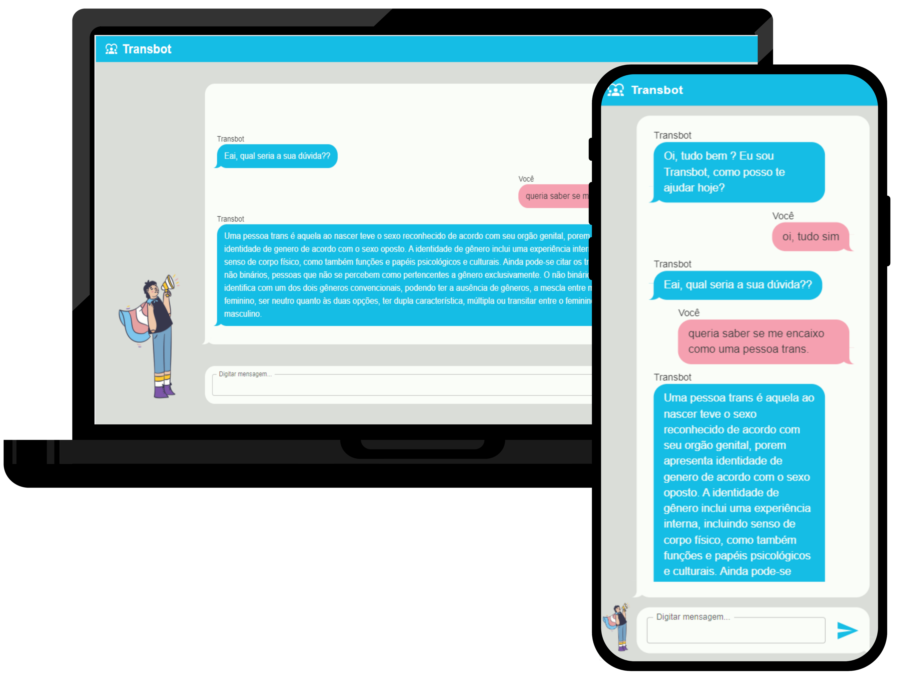

# Transbot front-end - (colocar o nome quando tiver)

**PT-BR:** Implementação do front-end de um chatbot para o processo transexualizador utilizando redes neurais recorrentes e processamento de liguagem natural escrita em português.

**EN-US:** Implementation of a chatbot front-end for the transsexualization process using recurrent neural networks and natural language processing written in portuguese.

## Main Dependences
- react 18
- material ui 5
- vite 4

## Author

- [Andrigo Borba dos Santos](https://github.com/andrigoBS)

## Installation
**1.** Run: `npm install` \

## Running
**1.** Run: `npm run start` \

## UI

